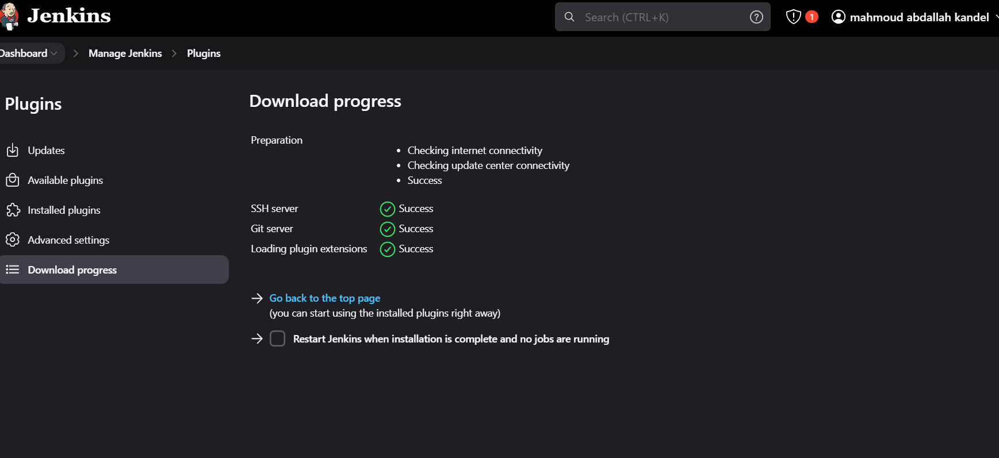

# Jenkins-labs

1- What is the packages is a prerequisite for installing Jenkins ?

To install Jenkins, you typically need to have Java Development Kit (JDK) installed on your system. Jenkins is a Java-based application, so having JDK ensures that you can run Jenkins on your machine. Here are the basic steps:

1. **Install Java Development Kit (JDK)**:
   - Jenkins requires Java to run. Install JDK 8 or later versions. You can download JDK from Oracle's website or use OpenJDK, which is often available through your operating system's package manager.

2. **Install Jenkins**:
   - Once JDK is installed, you can proceed to install Jenkins. Instructions for installation vary depending on your operating system (Linux, macOS, Windows) and the method you choose (package manager, direct download, Docker, etc.).

3. **Other Considerations**:
   - Ensure that your system meets any additional requirements depending on your setup (e.g., network access for plugin installation, sufficient system resources).

By installing JDK first, you ensure that Jenkins has the necessary Java runtime environment to operate.

2- Run this command and tell me the ssh port: curl -Lv http://localhost:8085/login 2>&1 | grep -i 'x-ssh-endpoint'

nothing appear 


- What are jenkins plugins?

	A. Plugins are used to configure the security settings in Jenkins.
	B. Plugins are the primary means of enhancing the functionality of a Jenkins environment to suit organization or user specific needs.
	C. Plugins are used to create jobs in Jenkins.
	D. Plugins are the tools to setup CI/CD pipelines in Jenkins.


The correct answer is:

B. Plugins are the primary means of enhancing the functionality of a Jenkins environment to suit organization or user specific needs.

Jenkins plugins allow users to extend and customize Jenkins with additional features, such as integrating with different tools, setting up complex CI/CD pipelines, managing security, and much more.


- Can we install the .hpi plugin file from Jenkins web UI?

Yes, you can install `.hpi` plugin files from the Jenkins web UI. Here's how:

1. Download the `.hpi` plugin file that you want to install.
2. Go to the Jenkins web UI and navigate to **Manage Jenkins**.
3. Select Manage Plugins.
4. Click on the Advanced tab.
5. Under Upload Plugin, you will find an option to upload the `.hpi` file.
6. Click Choose File, select the `.hpi` file from your system, and then click Upload.

Once uploaded, the plugin will be installed, and Jenkins may require a restart to activate the plugin.


5- Make sure that Git and Github plugins are installed if it's not kindly install them
 
done i have installed them 



6- Install Jenkins as normal service or as docker container (bouns install it using ansible)

i have already install it 


7- Under what location Jenkins store its data primarily?

answer: /var/lib/jenkins

8- Install and configure thinbackup plugin and make sure that the default dir for backup is: /var/lib/jenkins/jenkins_backup


9- Create a Jenkins user as per the details provided below.

	A. Username: jenkins
	B. Password: jenk!n$
	C. Full Name: Orange DevOps


    


10- Install the Role-based Authorization Strategy plugin and enable the Role-Based Strategy authorization in Jenkins security settings.

    

    If you are logged in as `mahmoudbero` and are missing the **Overall/Read** permission, you can follow these steps to grant yourself the permission, assuming you have administrative rights:

### Step 1: Access Jenkins as an Admin

1. **Log in as Admin:**
   Log out and log back in using an admin account that has the necessary permissions to manage roles.

### Step 2: Manage Roles

1. **Go to Manage Jenkins:**
   Click on **"Manage Jenkins"** from the left sidebar.

2. **Manage and Assign Roles:**
   Click on **"Manage and Assign Roles."**

3. **Manage Roles:**
   Click on **"Manage Roles."**

### Step 3: Edit Role Permissions

1. **Locate the Role:**
   Identify the role assigned to `mahmoudbero`. If you're unsure, check all roles for the one that includes `mahmoudbero`.

2. **Check Overall/Read Permission:**
   Ensure that the **Overall/Read** permission is checked for that role.

3. **Save Changes:**
   Click **"Save"** to apply any changes.

### Step 4: Assign Role to User

1. **Assign Roles:**
   Go back to **"Assign Roles."**

2. **Find User:**
   Locate `mahmoudbero` in the list of users.

3. **Ensure Role Assignment:**
   Make sure the role with the **Overall/Read** permission is selected for `mahmoudbero`.

4. **Save Changes:**
   Click **"Save"** to confirm.

### Step 5: Log Back In

1. **Log Out and Back In:**
   Log out of Jenkins and then log back in as `mahmoudbero`.

2. **Check Access:**
   Verify that you can now access the Jenkins dashboard.


12- Create a role named developers and make sure it has overall Read permissions alone. Also assign role called developers to the user called jenkins.


To create a role named "developers" with **Overall/Read** permissions and assign it to the user `jenkins`, follow these steps:

### Step 1: Access Role Management

1. **Log in to Jenkins:**
   Make sure you are logged in with an account that has administrative privileges.

2. **Manage Jenkins:**
   Click on **"Manage Jenkins"** in the left sidebar.

3. **Manage and Assign Roles:**
   Click on **"Manage and Assign Roles."**

### Step 2: Create the "developers" Role

1. **Manage Roles:**
   Click on **"Manage Roles."**

2. **Add Role:**
   In the **"Roles"** section, enter `developers` in the text box to create a new role.

3. **Set Permissions:**
   - Check the **Overall/Read** permission for this role.
   - Ensure no other permissions are checked.

4. **Save Changes:**
   Click **"Save"** to apply your changes.

### Step 3: Assign the Role to the User

1. **Go to Assign Roles:**
   Click on **"Assign Roles."**

2. **Locate User:**
   Find the user `jenkins` in the list of users.

3. **Assign Role:**
   - In the **"Developers"** column, check the box next to the `developers` role for the user `jenkins`.

4. **Save Changes:**
   Click **"Save"** to confirm the assignments.

### Step 4: Verify Role Assignment

1. **Log Out and Back In:**
   Have the user `jenkins` log out and then log back in to refresh their permissions.

2. **Check Access:**
   Verify that the user `jenkins` can access Jenkins and has the expected permissions.


13- First, install the Matrix Authorization Strategy plugin and using the Project-based Matrix Authorization Strategy assign some permissions that would allow jenkins to build the mytest job.

	Once this is done, build this job through user jenkins.
	Note: You should use jenkins's credentials from the previous question.
	
		Username: jenkins
		Password: jenk!n$


To install the **Matrix Authorization Strategy** plugin, configure it for project-based permissions, and then build the `mytest` job using the `jenkins` user credentials, follow these steps:

### Step 1: Install the Matrix Authorization Strategy Plugin

1. **Access Jenkins Dashboard:**
   Open your Jenkins instance in a web browser.

2. **Manage Jenkins:**
   Click on **"Manage Jenkins"** from the left sidebar.

3. **Manage Plugins:**
   Click on **"Manage Plugins."**

4. **Available Tab:**
   Go to the **"Available"** tab.

5. **Search for Matrix Authorization Strategy:**
   In the search box, type **"Matrix Authorization Strategy."**

6. **Install the Plugin:**
   Check the box next to **"Matrix Authorization Strategy"** and click on **"Install without restart."**

### Step 2: Enable Matrix Authorization Strategy

1. **Manage Jenkins:**
   After the installation, go back to **"Manage Jenkins."**

2. **Configure Global Security:**
   Click on **"Configure Global Security."**

3. **Authorization Section:**
   In the **"Authorization"** section, select **"Project-based Matrix Authorization Strategy."**

4. **Save Configuration:**
   Scroll down and click **"Save"** to apply your settings.

### Step 3: Configure Job Permissions for `mytest`

1. **Go to the `mytest` Job:**
   Find and click on the `mytest` job in the Jenkins dashboard.

2. **Configure the Job:**
   Click on **"Configure"** from the left sidebar of the job page.

3. **Project-based Authorization:**
   Scroll down to the **"Authorization"** section.

4. **Add User Permissions:**
   - Check the box for **"Enable project-based security."**
   - In the permissions matrix, find the user `jenkins` and grant the following permissions:
     - **Job/Read**
     - **Job/Build**
     - (You can add other permissions as necessary, but these are the minimum for building the job.)

5. **Save Configuration:**
   Click **"Save"** to apply your changes.

### Step 4: Build the Job as User `jenkins`

1. **Log Out:**
   Log out of Jenkins.

2. **Log In as `jenkins`:**
   Use the credentials:
   - **Username:** `jenkins`
   - **Password:** `jenk!n$`

3. **Access the `mytest` Job:**
   Once logged in, navigate to the `mytest` job.

4. **Build the Job:**
   Click on **"Build Now"** to start the job.

### Step 5: Verify Build Status

1. **Check Build History:**
   After triggering the build, check the build history in the job page to see if it was successful.


14- Install Pipeline Jenkins plugin?

To install the Pipeline plugin in Jenkins, follow these steps:

### Step 1: Access Jenkins Dashboard

1. **Open your Jenkins Instance:**
   Navigate to your Jenkins instance in a web browser.

### Step 2: Manage Jenkins

1. **Click on "Manage Jenkins":**
   This option is usually found on the left sidebar.

### Step 3: Manage Plugins

1. **Click on "Manage Plugins":**
   This will take you to the plugin management page.

### Step 4: Install Pipeline Plugin

1. **Available Tab:**
   Go to the **"Available"** tab.

2. **Search for Pipeline:**
   In the search box, type **"Pipeline"**.

3. **Select the Pipeline Plugin:**
   Check the box next to **"Pipeline"** (you may also see related plugins like **"Pipeline: Build Step"** or **"Pipeline: Groovy"**).

4. **Install:**
   Click on **"Install without restart"** to install the selected plugin.

### Step 5: Verify Installation

1. **Go Back to Manage Plugins:**
   After installation, navigate to the **"Installed"** tab to confirm that the Pipeline plugin is listed.

2. **Restart Jenkins (if needed):**
   While most plugins can be used immediately, if prompted, consider restarting Jenkins to ensure everything loads correctly.


15- Create a pipeline job named hello-world, it should just echo the Hello World string.


To create a simple pipeline job named `hello-world` that echoes the "Hello World" string in Jenkins, follow these steps:

### Step 1: Access Jenkins Dashboard

1. **Open Jenkins:**
   Navigate to your Jenkins instance in a web browser.

### Step 2: Create a New Pipeline Job

1. **Click on "New Item":**
   On the left sidebar, click on **"New Item."**

2. **Enter Job Name:**
   In the **"Enter an item name"** field, type `hello-world`.

3. **Select Pipeline:**
   Choose **"Pipeline"** as the type of job.

4. **Click "OK":**
   This will take you to the job configuration page.

### Step 3: Configure the Pipeline Job

1. **Pipeline Section:**
   Scroll down to the **"Pipeline"** section.

2. **Definition:**
   Ensure that **"Pipeline script"** is selected.

3. **Pipeline Script:**
   In the text area provided, enter the following script:

   ```groovy
   pipeline {
       agent any
       stages {
           stage('Greeting') {
               steps {
                   script {
                       echo 'Hello World'
                   }
               }
           }
       }
   }
   ```

### Step 4: Save the Job

1. **Click "Save":**
   After entering the script, click on the **"Save"** button at the bottom of the page.

### Step 5: Build the Job

1. **Run the Job:**
   On the job page, click on **"Build Now"** to run the pipeline.

### Step 6: Check Console Output

1. **View Build Output:**
   After the build completes, click on the build number (e.g., `#1`) under **"Build History."**

2. **Console Output:**
   Click on **"Console Output"** to view the logs. You should see `Hello World` in the output.


16- Install SSH Build Agents Jenkins plugin.

To install the SSH Build Agents plugin in Jenkins, follow these steps:

### Step 1: Access Jenkins Dashboard

1. **Open Jenkins:**
   Navigate to your Jenkins instance in a web browser.

### Step 2: Manage Jenkins

1. **Click on "Manage Jenkins":**
   This option is usually found on the left sidebar.

### Step 3: Manage Plugins

1. **Click on "Manage Plugins":**
   This will take you to the plugin management page.

### Step 4: Install SSH Build Agents Plugin

1. **Available Tab:**
   Go to the **"Available"** tab.

2. **Search for SSH Build Agents:**
   In the search box, type **"SSH Build Agents."**

3. **Select the Plugin:**
   Check the box next to **"SSH Build Agents"**.

4. **Install:**
   Click on **"Install without restart"** to install the selected plugin.

### Step 5: Verify Installation

1. **Go Back to Manage Plugins:**
   After installation, navigate to the **"Installed"** tab to confirm that the SSH Build Agents plugin is listed.

2. **Restart Jenkins (if needed):**
   While most plugins can be used immediately, if prompted, consider restarting Jenkins to ensure everything loads correctly.

17- Create a simple Jenkins job that prints "Hello, World!" in the console output.
	Set up a basic Freestyle job with a shell command to print a message.

    To create a simple Jenkins job that prints "Hello, World!" using a Freestyle job, follow these steps:

### Step 1: Access Jenkins Dashboard

1. **Open Jenkins:**
   Navigate to your Jenkins instance in a web browser.

### Step 2: Create a New Freestyle Job

1. **Click on "New Item":**
   On the left sidebar, click on **"New Item."**

2. **Enter Job Name:**
   In the **"Enter an item name"** field, type `hello-world`.

3. **Select Freestyle Project:**
   Choose **"Freestyle project"** as the type of job.

4. **Click "OK":**
   This will take you to the job configuration page.

### Step 3: Configure the Freestyle Job

1. **General Section:**
   (You can add a description if you want, but it's optional.)

2. **Build Section:**
   Scroll down to the **"Build"** section.

3. **Add Build Step:**
   Click on **"Add build step,"** then select **"Execute shell."**

4. **Shell Command:**
   In the command text area, enter the following:

   ```bash
   echo "Hello, World!"
   ```

### Step 4: Save the Job

1. **Click "Save":**
   After entering the command, click on the **"Save"** button at the bottom of the page.

### Step 5: Build the Job

1. **Run the Job:**
   On the job page, click on **"Build Now"** to run the job.

### Step 6: Check Console Output

1. **View Build Output:**
   After the build completes, click on the build number (e.g., `#1`) under **"Build History."**

2. **Console Output:**
   Click on **"Console Output"** to view the logs. You should see `Hello, World!` in the output.

18- Configure a Jenkins job to pull code from a public GitHub repository.
	Use the Git plugin to connect to the repository and check out the latest code.

    To configure a Jenkins job to pull code from a public GitHub repository using the Git plugin, follow these steps:

### Step 1: Access Jenkins Dashboard

1. **Open Jenkins:**
   Navigate to your Jenkins instance in a web browser.

### Step 2: Create a New Freestyle Job

1. **Click on "New Item":**
   On the left sidebar, click on **"New Item."**

2. **Enter Job Name:**
   In the **"Enter an item name"** field, type `github-pull`.

3. **Select Freestyle Project:**
   Choose **"Freestyle project"** as the type of job.

4. **Click "OK":**
   This will take you to the job configuration page.

### Step 3: Configure the Job

1. **Source Code Management:**
   Scroll down to the **"Source Code Management"** section.

2. **Select Git:**
   Choose **"Git."**

3. **Repository URL:**
   In the **"Repository URL"** field, enter the URL of your public GitHub repository. For example:
   ```
   https://github.com/username/repo.git
   ```

4. **Branch to Build:**
   In the **"Branches to build"** field, you can specify the branch you want to check out, such as `*/main` or `*/master`.

### Step 4: Add Build Step (Optional)

1. **Build Step:**
   If you want to perform an action after pulling the code, scroll down to the **"Build"** section.

2. **Add Build Step:**
   Click on **"Add build step,"** then choose **"Execute shell."**

3. **Shell Command:**
   Enter any shell commands you want to run after checking out the code. For example:
   ```bash
   echo "Code pulled from GitHub!"
   ```

### Step 5: Save the Job

1. **Click "Save":**
   After configuring the job, click on the **"Save"** button at the bottom of the page.

### Step 6: Build the Job

1. **Run the Job:**
   On the job page, click on **"Build Now"** to run the job.

### Step 7: Check Console Output

1. **View Build Output:**
   After the build completes, click on the build number (e.g., `#1`) under **"Build History."**

2. **Console Output:**
   Click on **"Console Output"** to view the logs. You should see messages indicating that the code was pulled from GitHub.

19- Set up a Jenkins job that triggers every 5 minutes using the "Build periodically" option.
	Use the cron syntax to configure the trigger.

    To set up a Jenkins job that triggers every 5 minutes using the "Build periodically" option, follow these steps:

### Step 1: Access Jenkins Dashboard

1. **Open Jenkins:**
   Navigate to your Jenkins instance in a web browser.

### Step 2: Create a New Job or Access an Existing Job

1. **Click on "New Item"** (if creating a new job):
   - Enter a name for your job (e.g., `periodic-job`).
   - Select **"Freestyle project"** and click **"OK."**

   **OR**

   **Access an Existing Job:**
   - Click on the job you want to configure.

### Step 3: Configure Build Triggers

1. **Scroll Down to "Build Triggers":**
   In the job configuration page, find the **"Build Triggers"** section.

2. **Check "Build Periodically":**
   Check the box for **"Build periodically."**

3. **Enter Cron Syntax:**
   In the text area provided, enter the following cron syntax to trigger the job every 5 minutes:

   ```
   H/5 * * * *
   ```

   - This syntax means: 
     - `H/5` - Every 5 minutes (the `H` allows Jenkins to randomly choose a minute within that 5-minute interval to distribute load).
     - The rest of the asterisks (`* * *`) mean every hour, every day, every month, and every day of the week.

### Step 4: Save the Job

1. **Click "Save":**
   After configuring the build trigger, scroll down and click the **"Save"** button.

### Step 5: Verify Configuration

1. **Check the Job Page:**
   On the job page, you should see the next scheduled build time based on your cron configuration.

20- Install a Jenkins plugin from the Plugin Manager.
	Pick any plugin (Docker) and verify that it's successfully installed.

    To install the Docker plugin in Jenkins and verify that it has been successfully installed, follow these steps:

### Step 1: Access Jenkins Dashboard

1. **Open Jenkins:**
   Navigate to your Jenkins instance in a web browser.

### Step 2: Manage Jenkins

1. **Click on "Manage Jenkins":**
   This option is usually found on the left sidebar.

### Step 3: Manage Plugins

1. **Click on "Manage Plugins":**
   This will take you to the plugin management page.

### Step 4: Install the Docker Plugin

1. **Available Tab:**
   Go to the **"Available"** tab.

2. **Search for Docker:**
   In the search box, type **"Docker."**

3. **Select the Plugin:**
   Check the box next to **"Docker"** (you may also see related plugins like **"Docker Pipeline"**).

4. **Install:**
   Click on **"Install without restart"** to install the selected plugin.

### Step 5: Verify Installation

1. **Go Back to Manage Plugins:**
   After installation, navigate to the **"Installed"** tab to confirm that the Docker plugin is listed.

2. **Search in Installed Plugins:**
   You can use the search box to find "Docker" quickly.

3. **Check Version:**
   Make sure it shows the version number next to the plugin name, indicating it has been installed successfully.

4. **Restart Jenkins (if needed):**
   While most plugins can be used immediately, if prompted, consider restarting Jenkins to ensure everything loads correctly.

21- Configure a Jenkins job to send email notifications when a build fails.
	Set up the Email Extension Plugin and define an email recipient list.

    To configure a Jenkins job to send email notifications when a build fails using the Email Extension Plugin, follow these steps:

### Step 1: Install the Email Extension Plugin (if not already installed)

1. **Access Jenkins Dashboard:**
   Open your Jenkins instance in a web browser.

2. **Manage Jenkins:**
   Click on **"Manage Jenkins"** from the left sidebar.

3. **Manage Plugins:**
   Click on **"Manage Plugins."**

4. **Available Tab:**
   Go to the **"Available"** tab and search for **"Email Extension Plugin."**

5. **Install the Plugin:**
   Check the box next to **"Email Extension Plugin"** and click **"Install without restart."**

### Step 2: Configure Email Notifications

1. **Go to the Job Configuration:**
   Navigate to the job you want to configure (or create a new job).

2. **Click on "Configure":**
   Open the job configuration page.

3. **Add Build Step:**
   Scroll down to the **"Post-build Actions"** section.

4. **Add Email Notification:**
   Click on **"Add post-build action,"** then select **"Editable Email Notification."**

5. **Configure Email Notification:**
   - **Project Recipient List:** Enter the email addresses of the recipients who should receive notifications (comma-separated if multiple). For example:
     ```
     user1@example.com, user2@example.com
     ```
   - **Trigger for Emails:** In the **"Triggers"** section, select **"Failure - Any"** to send an email when the build fails.

6. **Configure Email Content (Optional):**
   - You can customize the email content in the **"Content"** section.
   - Use predefined templates or set your own subject and body text.

### Step 3: Set Up SMTP Server

1. **Manage Jenkins:**
   Return to the Jenkins dashboard and click on **"Manage Jenkins."**

2. **Configure System:**
   Click on **"Configure System."**

3. **E-mail Notification Section:**
   Scroll to the **"E-mail Notification"** section.
   - **SMTP Server:** Enter your SMTP server address (e.g., `smtp.example.com`).
   - **Default User E-mail Suffix:** If needed, enter the domain suffix for user emails (e.g., `@example.com`).
   - **Use SMTP Authentication:** If your SMTP server requires authentication, check this box and provide the username and password.

4. **Test Configuration:**
   Use the **"Test configuration by sending test e-mail"** option to ensure that the setup is working correctly.

5. **Save Configuration:**
   Click **"Save"** to apply any changes.

### Step 4: Save the Job Configuration

1. **Click "Save":**
   After configuring the email notifications, click on the **"Save"** button at the bottom of the job configuration page.

### Step 5: Test the Configuration

1. **Trigger a Build:**
   Manually trigger a build that you know will fail (if you don't have one readily available).

2. **Check Email Notifications:**
   After the build fails, check the designated email inbox for the failure notification.

22- Create a Jenkins pipeline with two stages:
	Stage 1: Pull code from GitHub(repo from your choise)
	Stage 2: Run a simple shell script that lists all files in the workspace.


To create a Jenkins pipeline with two stages—pulling code from GitHub and running a shell script to list all files in the workspace—follow these steps:

### Step 1: Access Jenkins Dashboard

1. **Open Jenkins:**
   Navigate to your Jenkins instance in a web browser.

### Step 2: Create a New Pipeline Job

1. **Click on "New Item":**
   On the left sidebar, click on **"New Item."**

2. **Enter Job Name:**
   In the **"Enter an item name"** field, type `list-files-pipeline`.

3. **Select Pipeline:**
   Choose **"Pipeline"** as the type of job.

4. **Click "OK":**
   This will take you to the job configuration page.

### Step 3: Configure the Pipeline Script

1. **Pipeline Section:**
   Scroll down to the **"Pipeline"** section.

2. **Definition:**
   Ensure that **"Pipeline script"** is selected.

3. **Pipeline Script:**
   In the text area provided, enter the following script:

   ```groovy
   pipeline {
       agent any
       stages {
           stage('Pull Code from GitHub') {
               steps {
                   git url: 'https://github.com/username/repo.git', branch: 'main'
               }
           }
           stage('List Files') {
               steps {
                   script {
                       sh 'ls -al'
                   }
               }
           }
       }
   }
   ```

   Replace `https://github.com/username/repo.git` with the URL of your chosen GitHub repository and adjust the branch if necessary.

### Step 4: Save the Job

1. **Click "Save":**
   After entering the script, click on the **"Save"** button at the bottom of the page.

### Step 5: Build the Job

1. **Run the Job:**
   On the job page, click on **"Build Now"** to execute the pipeline.

### Step 6: Check Console Output

1. **View Build Output:**
   After the build completes, click on the build number (e.g., `#1`) under **"Build History."**

2. **Console Output:**
   Click on **"Console Output"** to view the logs. You should see the list of files in the workspace printed in the output.

23- Set up a Jenkins job to archive log files generated by the build.
	Use the "Archive the artifacts" post-build action to store the logs.


To set up a Jenkins job that archives log files generated by the build using the "Archive the artifacts" post-build action, follow these steps:

### Step 1: Access Jenkins Dashboard

1. **Open Jenkins:**
   Navigate to your Jenkins instance in a web browser.

### Step 2: Create a New Job or Access an Existing Job

1. **Click on "New Item"** (if creating a new job):
   - Enter a name for your job (e.g., `archive-logs-job`).
   - Select **"Freestyle project"** and click **"OK."**

   **OR**

   **Access an Existing Job:**
   - Click on the job you want to configure.

### Step 3: Configure the Job

1. **Add Build Steps:**
   Scroll down to the **"Build"** section and add steps to generate log files. For example, you could add a shell command that creates a log file:

   - Click on **"Add build step,"** then select **"Execute shell."**
   - In the command text area, enter:

     ```bash
     echo "This is a log file." > build.log
     ```

2. **Post-build Actions:**
   Scroll down to the **"Post-build Actions"** section.

3. **Add Archive Artifacts:**
   Click on **"Add post-build action,"** then select **"Archive the artifacts."**

4. **Specify Artifacts to Archive:**
   In the **"Files to archive"** field, enter the path to your log files. For example, to archive `build.log`, enter:

   ```
   build.log
   ```

   If you want to archive multiple log files, you can use wildcards (e.g., `*.log`).

### Step 4: Save the Job

1. **Click "Save":**
   After configuring the job, click on the **"Save"** button at the bottom of the page.

### Step 5: Build the Job

1. **Run the Job:**
   On the job page, click on **"Build Now"** to execute the job.

### Step 6: Check Archived Artifacts

1. **View Build History:**
   After the build completes, click on the build number (e.g., `#1`) under **"Build History."**

2. **Access Archived Artifacts:**
   On the build page, look for the **"Artifacts"** section. You should see `build.log` listed there.

3. **Download the Logs:**
   Click on the log file name to download and view the archived log files.


24- Set up a Jenkins job to clean up old builds (e.g., only keep the last 5 builds).
	Configure the job to discard old builds using the "Discard Old Builds" option.


    To set up a Jenkins job that cleans up old builds by keeping only the last 5 builds, follow these steps:

### Step 1: Access Jenkins Dashboard

1. **Open Jenkins:**
   Navigate to your Jenkins instance in a web browser.

### Step 2: Create a New Job or Access an Existing Job

1. **Click on "New Item"** (if creating a new job):
   - Enter a name for your job (e.g., `cleanup-builds-job`).
   - Select **"Freestyle project"** and click **"OK."**

   **OR**

   **Access an Existing Job:**
   - Click on the job you want to configure.

### Step 3: Configure Build Discard Policy

1. **General Section:**
   Scroll down to the **"General"** section.

2. **Check "Discard Old Builds":**
   Find the option labeled **"Discard old builds"** and check the box.

3. **Set Build Retention:**
   In the fields provided, specify the following:
   - **Max # of builds to keep:** Enter `5`.
   - (Optionally) You can also specify a maximum age for builds in days or weeks, but this is not necessary if you just want to keep the last 5 builds.

### Step 4: Save the Job

1. **Click "Save":**
   After configuring the build discard policy, click on the **"Save"** button at the bottom of the page.

### Step 5: Build the Job

1. **Run the Job:**
   On the job page, click on **"Build Now"** to execute the job a few times to generate builds.

### Step 6: Verify Build Cleanup

1. **Check Build History:**
   After running the job multiple times, click on the **"Build History"** section.

2. **Verify Retained Builds:**
   You should see that only the last 5 builds are retained. Older builds should have been automatically discarded based on your configuration.


25- Create a Jenkins job that takes user input for a name and prints a greeting message in the console output (e.g., "Hello, [Name]!" ).
	Use the "This build is parameterized" option and add a string parameter.


    To create a Jenkins job that takes user input for a name and prints a greeting message in the console output, follow these steps:

### Step 1: Access Jenkins Dashboard

1. **Open Jenkins:**
   Navigate to your Jenkins instance in a web browser.

### Step 2: Create a New Job

1. **Click on "New Item":**
   On the left sidebar, click on **"New Item."**

2. **Enter Job Name:**
   In the **"Enter an item name"** field, type `greeting-job`.

3. **Select Freestyle Project:**
   Choose **"Freestyle project"** as the type of job.

4. **Click "OK":**
   This will take you to the job configuration page.

### Step 3: Configure the Job

1. **This Build is Parameterized:**
   Check the box that says **"This build is parameterized."**

2. **Add String Parameter:**
   - Click on **"Add Parameter."**
   - Select **"String Parameter."**
   - **Name:** Enter `NAME` (or any name you prefer).
   - **Default Value:** Optionally, you can set a default value (e.g., `World`).
   - **Description:** You can add a description, such as "Enter your name."

3. **Build Step:**
   Scroll down to the **"Build"** section.

4. **Add Build Step:**
   Click on **"Add build step,"** then select **"Execute shell."**

5. **Shell Command:**
   In the command text area, enter the following:

   ```bash
   echo "Hello, $NAME!"
   ```

### Step 4: Save the Job

1. **Click "Save":**
   After configuring the job, click on the **"Save"** button at the bottom of the page.

### Step 5: Build the Job

1. **Run the Job:**
   On the job page, click on **"Build Now."**

2. **Enter Name:**
   When prompted, enter a name (e.g., `Alice`) in the input field for the `NAME` parameter.

### Step 6: Check Console Output

1. **View Build Output:**
   After the build completes, click on the build number (e.g., `#1`) under **"Build History."**

2. **Console Output:**
   Click on **"Console Output"** to view the logs. You should see the greeting message, such as:

   ```
   Hello, Alice!
   ```

26- Set up a Jenkins job to build a Java project using the javac command.
	Ensure the job compiles a basic Java file and outputs the result.


    To set up a Jenkins job that builds a Java project using the `javac` command, follow these steps:

### Step 1: Access Jenkins Dashboard

1. **Open Jenkins:**
   Navigate to your Jenkins instance in a web browser.

### Step 2: Create a New Job

1. **Click on "New Item":**
   On the left sidebar, click on **"New Item."**

2. **Enter Job Name:**
   In the **"Enter an item name"** field, type `java-build-job`.

3. **Select Freestyle Project:**
   Choose **"Freestyle project"** as the type of job.

4. **Click "OK":**
   This will take you to the job configuration page.

### Step 3: Configure the Job

1. **Source Code Management:**
   If your Java files are in a Git repository, configure the SCM settings:
   - Scroll to the **"Source Code Management"** section.
   - Select **"Git."**
   - Enter the repository URL and branch details.

   If you're just testing locally, you can skip this step and add your Java files directly.

2. **Build Step:**
   Scroll down to the **"Build"** section.

3. **Add Build Step:**
   Click on **"Add build step,"** then select **"Execute shell."**

4. **Shell Command:**
   In the command text area, enter the following commands to compile a basic Java file (assuming your Java file is named `HelloWorld.java`):

   ```bash
   # Create a simple Java file if it doesn't exist
   echo 'public class HelloWorld {
       public static void main(String[] args) {
           System.out.println("Hello, World!");
       }
   }' > HelloWorld.java

   # Compile the Java file
   javac HelloWorld.java

   # Run the compiled Java program
   java HelloWorld
   ```

### Step 4: Save the Job

1. **Click "Save":**
   After configuring the job, click on the **"Save"** button at the bottom of the page.

### Step 5: Build the Job

1. **Run the Job:**
   On the job page, click on **"Build Now."**

### Step 6: Check Console Output

1. **View Build Output:**
   After the build completes, click on the build number (e.g., `#1`) under **"Build History."**

2. **Console Output:**
   Click on **"Console Output"** to view the logs. You should see the output:

   ```
   Hello, World!
   ```

27- Create a Jenkins job that runs a script to check for disk space usage on the Jenkins server.
	Use a simple shell script in the build step to check the disk space (df -h on Linux).


    To create a Jenkins job that runs a script to check for disk space usage on the Jenkins server using the `df -h` command, follow these steps:

### Step 1: Access Jenkins Dashboard

1. **Open Jenkins:**
   Navigate to your Jenkins instance in a web browser.

### Step 2: Create a New Job

1. **Click on "New Item":**
   On the left sidebar, click on **"New Item."**

2. **Enter Job Name:**
   In the **"Enter an item name"** field, type `disk-space-check-job`.

3. **Select Freestyle Project:**
   Choose **"Freestyle project"** as the type of job.

4. **Click "OK":**
   This will take you to the job configuration page.

### Step 3: Configure the Job

1. **Build Step:**
   Scroll down to the **"Build"** section.

2. **Add Build Step:**
   Click on **"Add build step,"** then select **"Execute shell."**

3. **Shell Command:**
   In the command text area, enter the following command to check disk space usage:

   ```bash
   df -h
   ```

### Step 4: Save the Job

1. **Click "Save":**
   After configuring the job, click on the **"Save"** button at the bottom of the page.

### Step 5: Build the Job

1. **Run the Job:**
   On the job page, click on **"Build Now."**

### Step 6: Check Console Output

1. **View Build Output:**
   After the build completes, click on the build number (e.g., `#1`) under **"Build History."**

2. **Console Output:**
   Click on **"Console Output"** to view the logs. You should see the disk space usage details displayed, similar to the following:

   ```
   Filesystem      Size  Used Avail Use% Mounted on
   /dev/sda1       50G   20G   30G  40% /
   tmpfs           2.0G  1.5M  2.0G   1% /dev/shm
   ```
28- Create a Jenkins job that executes a Python script from the repository search for a repo or create one.
	Ensure the job pulls the script from GitHub and runs it.


    To create a Jenkins job that executes a Python script from a GitHub repository, follow these steps:

### Step 1: Create a GitHub Repository (if needed)

1. **Create a GitHub Account:**
   If you don't have one, sign up for a GitHub account.

2. **Create a New Repository:**
   - Go to your GitHub profile.
   - Click on **"New"** to create a new repository.
   - Name it (e.g., `python-script-repo`).
   - Add a description (optional).
   - Choose visibility (public/private).
   - Click **"Create repository."**

3. **Add a Python Script:**
   - On your new repository page, click on **"Add file"** > **"Create new file."**
   - Name your file (e.g., `script.py`).
   - Add the following simple Python code:

     ```python
     print("Hello from the Python script!")
     ```

   - Scroll down and click **"Commit new file."**

### Step 2: Access Jenkins Dashboard

1. **Open Jenkins:**
   Navigate to your Jenkins instance in a web browser.

### Step 3: Create a New Job

1. **Click on "New Item":**
   On the left sidebar, click on **"New Item."**

2. **Enter Job Name:**
   In the **"Enter an item name"** field, type `python-script-job`.

3. **Select Freestyle Project:**
   Choose **"Freestyle project"** as the type of job.

4. **Click "OK":**
   This will take you to the job configuration page.

### Step 4: Configure the Job

1. **Source Code Management:**
   - Scroll to the **"Source Code Management"** section.
   - Select **"Git."**
   - Enter the URL of your GitHub repository (e.g., `https://github.com/yourusername/python-script-repo.git`).
   - (Optional) Specify the branch (default is `main`).

2. **Build Step:**
   Scroll down to the **"Build"** section.

3. **Add Build Step:**
   Click on **"Add build step,"** then select **"Execute shell."**

4. **Shell Command:**
   In the command text area, enter the following command to run the Python script:

   ```bash
   python3 script.py
   ```

   Make sure you have Python installed on the Jenkins server. If you want to specify a different Python version, adjust the command accordingly.

### Step 5: Save the Job

1. **Click "Save":**
   After configuring the job, click on the **"Save"** button at the bottom of the page.

### Step 6: Build the Job

1. **Run the Job:**
   On the job page, click on **"Build Now."**

### Step 7: Check Console Output

1. **View Build Output:**
   After the build completes, click on the build number (e.g., `#1`) under **"Build History."**

2. **Console Output:**
   Click on **"Console Output"** to view the logs. You should see the output:

   ```
   Hello from the Python script!
   ```
29- Configure a Jenkins job that runs on an agent (slave) node with specific labels ("linux").
	Set up a node with a label and configure the job to run only on that node.


    To configure a Jenkins job that runs on a specific agent (slave) node with the label "linux," follow these steps:

### Step 1: Set Up a Jenkins Agent

1. **Install Jenkins Agent:**
   - On your desired machine (the agent), ensure that Java is installed.
   - Download the Jenkins agent JAR file from your Jenkins master server:
     - Go to **Jenkins Dashboard** > **Manage Jenkins** > **Manage Nodes and Clouds**.
     - Click on **New Node**, and give it a name (e.g., `linux-agent`).
     - Select **Permanent Agent** and click **OK**.
     - Configure the agent with details like the remote root directory.
     - Set the **Labels** field to `linux`.
     - Click **Save**.

2. **Launch the Agent:**
   - In the nodes list, click on the newly created node.
   - Select **Launch agent by connecting it to the master**.
   - Follow the instructions to start the agent on the slave machine. This usually involves running a command like:

     ```bash
     java -jar agent.jar -jnlpUrl http://<your-jenkins-server>/computer/<agent-name>/jenkins-agent.jnlp -secret <secret>
     ```

### Step 2: Access Jenkins Dashboard

1. **Open Jenkins:**
   Navigate to your Jenkins instance in a web browser.

### Step 3: Create a New Job

1. **Click on "New Item":**
   On the left sidebar, click on **"New Item."**

2. **Enter Job Name:**
   In the **"Enter an item name"** field, type `linux-job`.

3. **Select Freestyle Project:**
   Choose **"Freestyle project"** as the type of job.

4. **Click "OK":**
   This will take you to the job configuration page.

### Step 4: Configure the Job to Run on the Specific Node

1. **Restrict where this project can be run:**
   - Scroll down to the **"General"** section.
   - Check the box labeled **"Restrict where this project can be run."**
   - In the field provided, enter the label `linux`.

2. **Build Step:**
   Scroll down to the **"Build"** section.

3. **Add Build Step:**
   Click on **"Add build step,"** then select **"Execute shell."**

4. **Shell Command:**
   In the command text area, enter a simple command, for example:

   ```bash
   echo "Running on a Linux agent!"
   ```

### Step 5: Save the Job

1. **Click "Save":**
   After configuring the job, click on the **"Save"** button at the bottom of the page.

### Step 6: Build the Job

1. **Run the Job:**
   On the job page, click on **"Build Now."**

### Step 7: Check Console Output

1. **View Build Output:**
   After the build completes, click on the build number (e.g., `#1`) under **"Build History."**

2. **Console Output:**
   Click on **"Console Output"** to view the logs. You should see:

   ```
   Running on a Linux agent!
   ```

